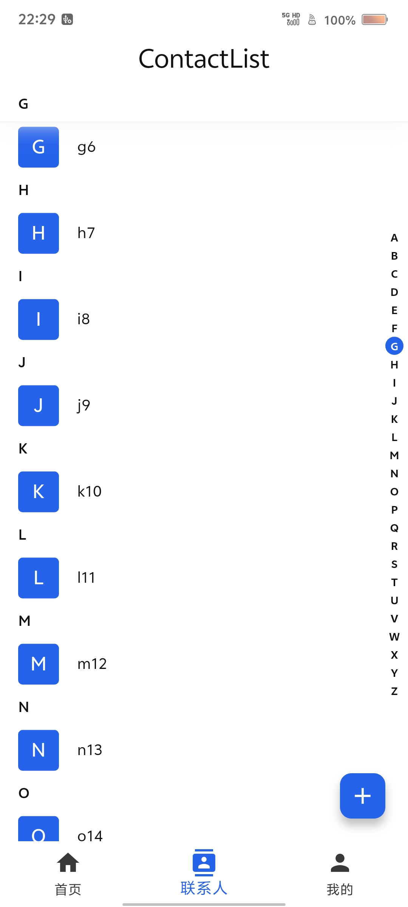
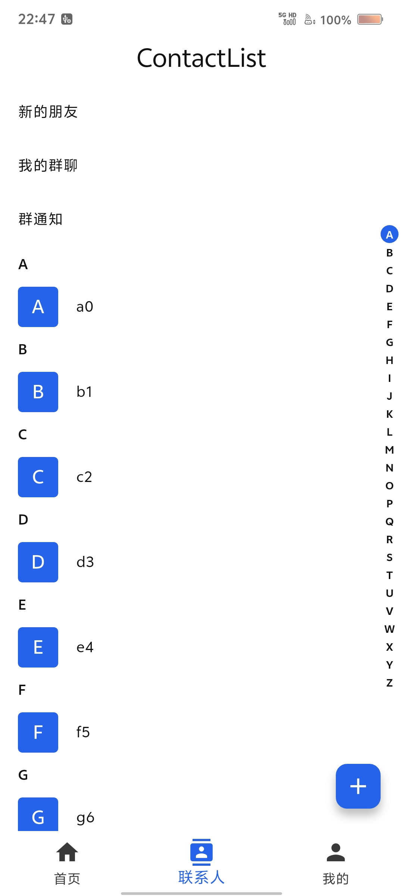

# contact_list_view

A Flutter contact list widget with sticky headers and an index bar.
Flutter 联系人列表组件，支持粘性分组头和字母索引条。

## Features / 特性

- Sticky section headers with optional custom builders / 粘性分组头，支持自定义构建器
- Alphabet index bar with cursor indicator / 字母索引条与游标提示
- Customizable styles, animations, and alignments / 支持样式、动画与对齐方式定制
- Sliver-based list for large data sets / 基于 Sliver，适配大数据量列表

|                         ScreenShot                         |                                              ScreenShot                                               |
|:----------------------------------------------------------:|:-----------------------------------------------------------------------------------------------------:|
|  | [](doc/videos/Screenrecording_20260202_222939.mp4) |


## Getting started / 快速开始

Add to `pubspec.yaml`:

```yaml
dependencies:
  contact_list_view: ^lasted
```

Then run:

```bash
flutter pub get
```

## Usage / 用法

```dart
import 'package:contact_list_view/contact_list_view.dart';
import 'package:flutter/material.dart';

class Contact {
  Contact(this.name);
  final String name;
}

class DemoPage extends StatelessWidget {
  const DemoPage({super.key});

  @override
  Widget build(BuildContext context) {
    final List<Contact> contacts = [
      Contact('Alice'),
      Contact('Bob'),
      Contact('张三'),
      Contact('李四'),
    ];

    String tagSelector(Contact c) {
      final String first = c.name.trim().isNotEmpty ? c.name.trim()[0] : '#';
      final String upper = first.toUpperCase();
      return RegExp(r'[A-Z]').hasMatch(upper) ? upper : '#';
    }

    return Scaffold(
      appBar: AppBar(title: const Text('Contacts')),
      body: ContactListView<Contact>(
        contactsList: contacts,
        tag: tagSelector,
        itemBuilder: (contact) => ListTile(title: Text(contact.name)),
        stickyHeaderHeight: 32,
      ),
    );
  }
}
```

## Customization / 自定义

- `stickyHeaderBuilder`: build your own header / 自定义分组头
- `cursorBuilder`: customize the cursor / 自定义游标
- `indexBarBoxDecorationBuilder` and `indexBarTextStyleBuilder`: style index items / 定制索引条样式

## Additional information / 其他信息

- Example app: `example/`
- Issues & contributions are welcome / 欢迎提交 Issue 与 PR
