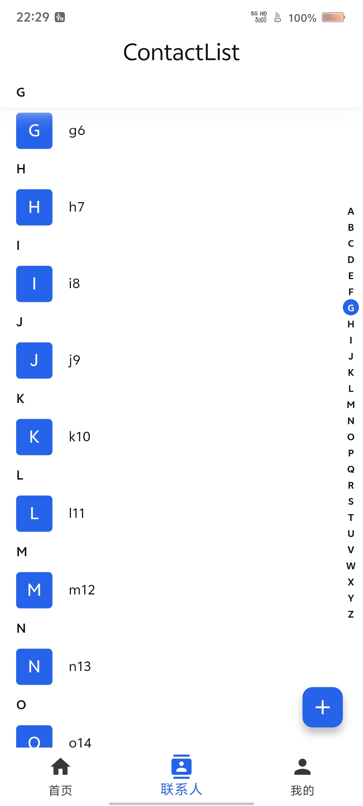
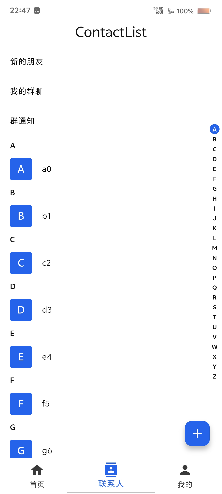

# contact_list_view

[English](README.md) | [中文](README_zh.md)

基于 Sliver 的 Flutter 联系人列表：A–Z 索引跳转、粘性分组头，以及索引条、游标、分组头的自定义构建器。

**在线示例：** https://matkurban.github.io/contact_list_view/

## 特性

- 粘性分组头，可用 `stickyHeaderBuilder` 完全自定义
- 字母索引条，拖动时显示游标
- 可定制装饰、文字样式、动画和对齐
- 使用 `SliverFixedExtentList`，适合较大数据量

|                         截图                         |                                                   截图                                                   |
| :--------------------------------------------------: | :------------------------------------------------------------------------------------------------------: |
|  | [](doc/videos/Screenrecording_20260202_222939.mp4) |

## 环境要求

- Dart `^3.12.0`
- Flutter `>=3.44.0`
- `Scaffold`、`ListTile`、`Theme` 等来自 [`material_ui`](https://pub.dev/packages/material_ui)（Flutter Material 拆包之后）

## 快速开始

在 `pubspec.yaml` 中加入：

```yaml
dependencies:
  contact_list_view: ^2.0.2
```

然后执行：

```bash
flutter pub get
```

本包随附 Agent Skills。在应用里依赖本包后安装：

```bash
dart run skills@ get
```

## 用法

`ContactListView` 的必填参数是 `contactsList`、`itemExtent`、`startItemExtent`、`endItemExtent`、`tag`、`itemBuilder`。即使 `startChildren` / `endChildren` 为空，两个 extent 也必须传。头尾区域是普通 `Widget`，不要包成 Sliver。

`tag` 是唯一分组键，返回值相同则同一组。标签恰好为 `'#'` 的分组会排到最后。组件**不会**按姓名排序。

```dart
import 'package:contact_list_view/contact_list_view.dart';
import 'package:material_ui/material_ui.dart';

class Contact {
  const Contact(this.name);
  final String name;
}

class DemoPage extends StatelessWidget {
  const DemoPage({super.key, required this.contacts});

  final List<Contact> contacts;

  static String tagOf(Contact contact) {
    final String raw = contact.name.trim();
    if (raw.isEmpty) return '#';
    final String upper = raw[0].toUpperCase();
    return RegExp(r'[A-Z]').hasMatch(upper) ? upper : '#';
  }

  @override
  Widget build(BuildContext context) {
    return Scaffold(
      appBar: AppBar(title: const Text('联系人')),
      body: ContactListView<Contact>(
        contactsList: contacts,
        itemExtent: 56,
        startItemExtent: 48,
        endItemExtent: 24,
        tag: tagOf,
        itemBuilder: (Contact contact) => ListTile(
          title: Text(contact.name),
        ),
        startChildren: const [
          ListTile(dense: true, title: Text('新的朋友')),
        ],
        endChildren: [
          Center(child: Text('共 ${contacts.length} 位联系人')),
        ],
      ),
    );
  }
}
```

联系人行高应对齐 `itemExtent`，头部子项对齐 `startItemExtent`，尾部子项对齐 `endItemExtent`。

列表内部自建 `ScrollController` 和 `CustomScrollView`，没有外部 controller 参数，也没有公开的 `jumpTo` / `scrollToIndex`。

更新数据：改 `contactsList`，再在父组件里 `setState`。

## 自定义

优先通过 `ContactListView` 的参数改默认样式，或用 builder 整段替换：

- `stickyHeaderBuilder` — `Widget Function(String tag, bool isPinned)`。一旦传入，默认头的 `stickyHeaderHeight`、padding、decoration、文字样式、对齐和头部动画都不会再生效。
- `cursorBuilder` — `Widget Function(String title)`。`cursorContainerSize` 仍用于定位（`top = offset.dy - cursorContainerSize / 2`）。
- `indexBarBoxDecorationBuilder` / `indexBarTextStyleBuilder` — 根据 `bool isSelected` 返回 `BoxDecoration` / `TextStyle`。
- `indexBarAlignment` 对齐整条索引轨；`indexBarItemAlignment` 对齐单个字母格。

可运行示例见 `example/`。

## 其他信息

- [English README](README.md)
- 示例应用：`example/`
- 欢迎提交 Issue 与 PR
